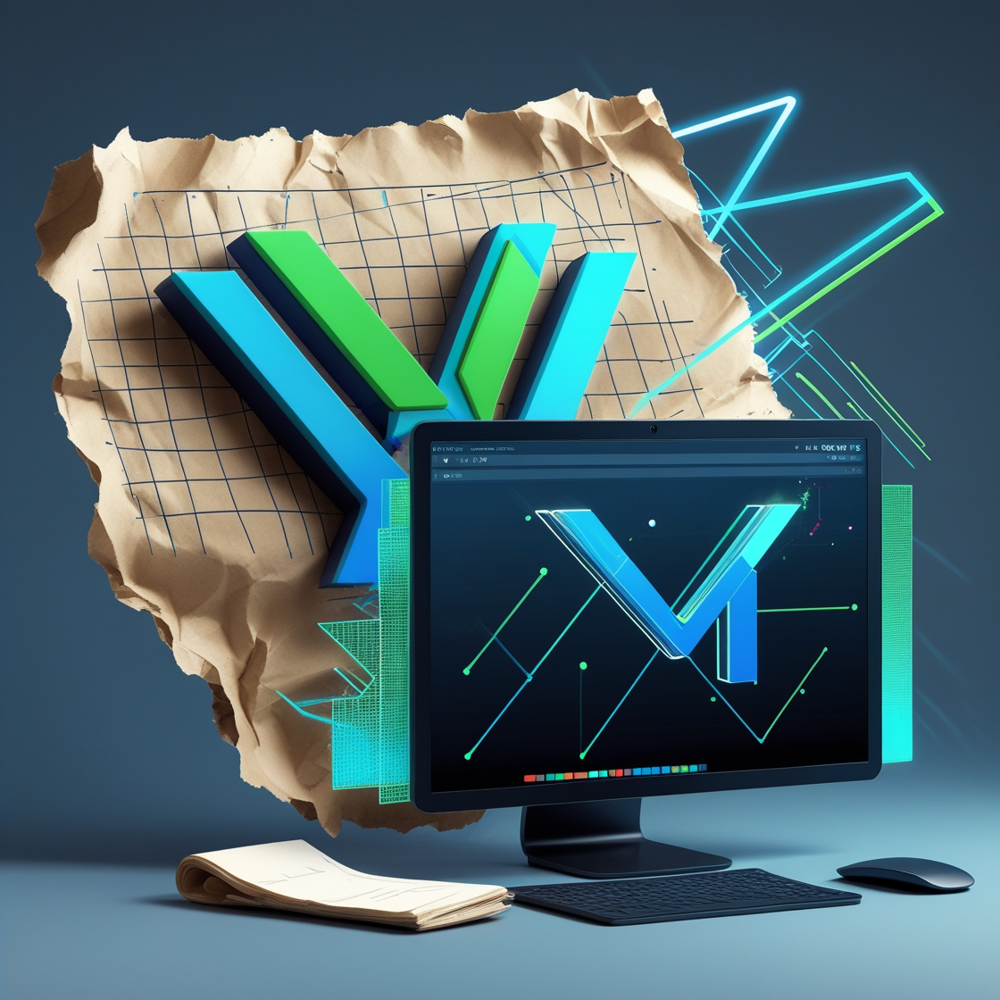

# Accra Digital ltd — Digital Future Portfolio



## Overview

This professional portfolio website showcases Accra Digital ltd' digital services, projects, and expertise. The platform serves as both a portfolio and client acquisition tool, offering complete digital presence solutions for organizations.

> **Slogan:** _Digital Future_  
> **Target Clients:** Churches, schools, charities, community organizations, businesses, entrepreneurs

## 🚀 Features

- **Modern Design**: Clean, professional interface with engaging animations
- **Responsive Layout**: Optimized for all devices (mobile, tablet, desktop)
- **Portfolio Showcase**: Filterable gallery of past projects
- **Service Listings**: Comprehensive display of digital services offered
- **Client Testimonials**: Social proof from satisfied clients
- **Contact System**: Integrated form with Web3Forms for client inquiries
- **SEO Optimized**: Meta tags and structured data for better search visibility

## 🛠️ Services Offered

- Website Development (WordPress, custom themes)
- Social Media Management
- Digital Content Creation
- Graphic Design (logos, flyers, brochures)
- E-commerce & Payment Integration
- Photo Editing & Optimization

## 💻 Tech Stack

- **Frontend**: React.js (Vite)
- **Styling**: Tailwind CSS
- **Animations**: Framer Motion
- **Routing**: React Router DOM
- **Form Handling**: Web3Forms (access key integrated)
- **Deployment**: Vercel

## 🏗️ Project Structure

```
/
├── public/             # Static files
├── src/
│   ├── assets/         # Images and other assets
│   ├── components/     # Reusable components
│   ├── pages/          # Page components
│   ├── App.jsx         # Main application component
│   └── main.jsx        # Application entry point
├── index.html          # HTML template
└── package.json        # Project dependencies and scripts
```

## 🚀 Getting Started

1. Clone the repository
2. Install dependencies: `npm install`
3. Start the development server: `npm run dev`
4. Build for production: `npm run build`

## 📧 Contact

For inquiries about digital services, please use the contact form on the website or reach out directly to Accra Digital ltd.

---

**Built for: Accra Digital ltd**  
**Business Motto: Digital Future**  
_"Empowering organizations with a complete digital presence."_ 